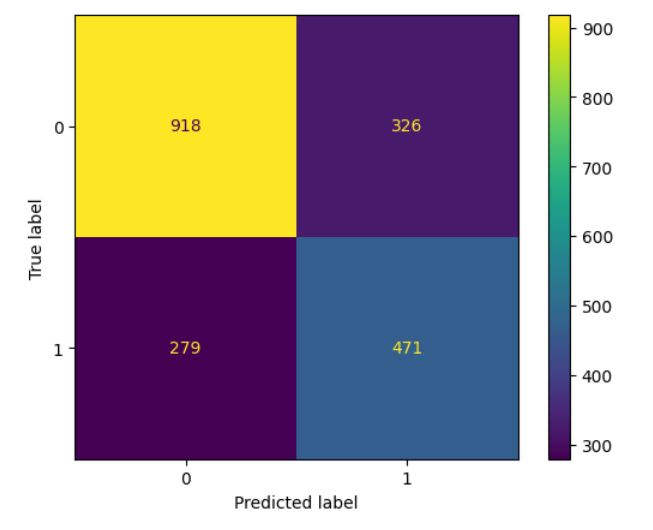

# Business Understanding

## Business Problem

With numerous consumers using social media to express their opinions on brands and products, it can be challenging for companies to extract valuable insights from the flood of messages. This project aims to assist companies in utilizing the information contained in tweets by developing a classification model. This model will enable companies to input the text of a tweet, or multiple tweets, and automatically classify the sentiment as "Positive" or "Not positive." This capability will help companies better organize and use the information from tweets received after launching a new product or in general.

Such a classification model has various applications, including:

- Gauging public opinion on a product, brand, or service
- Leveraging direct, unfiltered consumer feedback
- Easily retraining the model on custom datasets to target specific products, locations, or other focuses
- Identifying individuals who have shown positive or negative interest in the product, which can help in:
  - Better understanding target demographics
  - Advertising directly to those who already like the product
  - Using social media to reach the peer circles of people who like the product
  
## Sentiment Classification
A binary classification NLP model was developed using a sequential convolutional neural network. After many iterations, the final model achieved 76% accuracy in classifying the sentiment of new tweets as either "Positive" or "Not Positive." This performance, significantly better than random chance, offers valuable insights into the sentiments of the tweets and the users who posted them.

# Data Understanding
Our base data, which is the Brands and Product Emotions dataset, comes with three columns with categorical values, with every row being a separate tweet. The first column contains the text of the tweet. This text is copied striahgt from the original source, so it contains all the little unique things that tweets such as '@' mentions and '#' hashtags. The second column contains the target of the tweet. The target can be subjects such as 'iPad', 'iPhone', or 'Google' to name a few, and they denote what their respective tweet's subject is. For example, if the tweet target is 'Android App', we can assume that the tweet text in the same row has something to do with it. The last column contains the tweet sentiment, or the type of emotion the tweet text is showing. There are three possible values: positive, negative, and no emotion. A positive value would symbolize that the tweet has a positive feeling towards their listed target, while the opposite would be true if it was negative. A value of no emotion would mean that the tweet does not have a particularily strong feeling towards either side. As the tweet sentiment is the value that we are trying to predict, this will be our target column in our predictive models.

## Data Cleaning
Every tweet was cleaned of extraneous characters, including punctuation, URLs, hashtags, and common stopwords. Following this, the text was tokenized, and the tokens were lemmatized, resulting in a list of lemmatized words as tokens for each tweet.

# Explanatory Data Analysis

### Breakdown by Sentiment

Overall, negative sentiments dominate across brands, both in count and percentage of tweets. This aligns with the dataset, which contains about twice as many negative tweets compared to positive ones.

### Positive Tweets for Apple

The word cloud analysis reveals that Apple products, especially the iPad 2 and iPhone, are frequently mentioned in positive tweets. The iPhone app and Apple Store are also highlighted, indicating a strong positive sentiment. The presence of the word "free" suggests that giveaways or promotions may have boosted the positive tone. Additionally, there is a positive response to the new Apple Store in downtown Austin.

### Positive Tweets for Google

Analysis of positive tweets about Google shows a focus on terms like "map," "circle," "party," "launch," "social network," "new," "mobile," and "Marissa Mayer." This suggests a link between a social networking event and a recent product launch by the company. Like with Apple, the city of Austin is frequently mentioned, indicating potential regional events. Positive sentiment is also associated with the distribution of free products.

# Modelling and Evaluation

The model has an overall accuracy of 71%, correctly classifying 71% of the tweets. It accurately detected 83% of the negative sentiment tweets, showing a strong capability for identifying negative tweets. However, it only correctly identified 52% of the positive sentiment tweets, meaning it misses nearly half of the positive tweets.

Based on the analysis, the model using Combined Features, SMOTE, and RandomForestClassifier generally outperforms others, especially in terms of accuracy, precision, and recall for negative sentiment (Class 0). It also matches the Tuned Logistic Regression model in several metrics, including AUC.

For the goal of extracting useful information from tweets about Apple and Google products and exploring emotion distribution, the Pipeline with Combined Features, SMOTE, and RandomForestClassifier is the best choice. It offers a good balance of precision, recall, and overall accuracy, making it suitable for analyzing tweet sentiments.

# Summary
We created a model that can label tweets about a specific product with 71% accuracy. This can be used, in conjunction with a twitter crawler to pick tweets related to a brand or product, to determine how positively or negatively a specific product is being regarded in the Twitterverse during a specific timeframe. The best model we made was also the simplest, fastest, and least computationally demanding, a logistic regression model. However we used a lot of preprocessing to achieve this success. We focused the model on the target product by replacing the product name with 'targetproduct', tokenized and lemmatized the words to boil them down into their basic meanings, and then vectorized them using a count vectorizer to index them by how commonly they show up. The model used this heavily processed version of the tweets to determine their emotional content.

